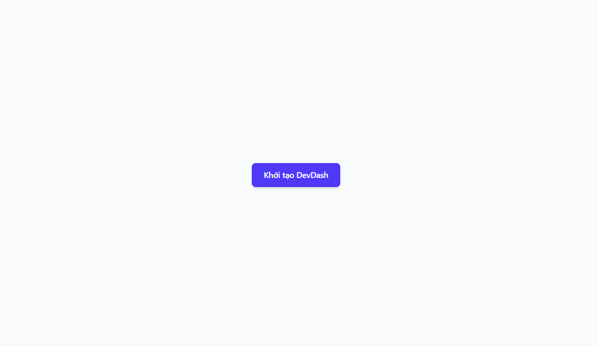
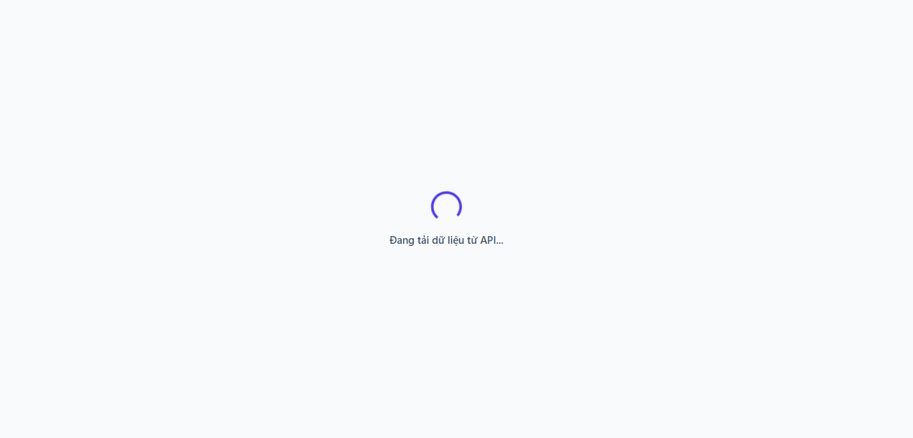
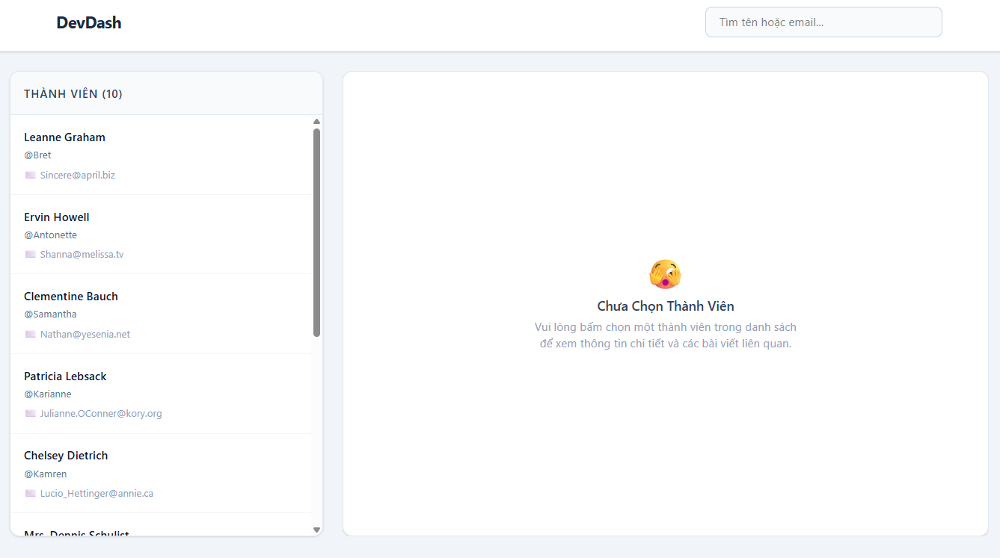
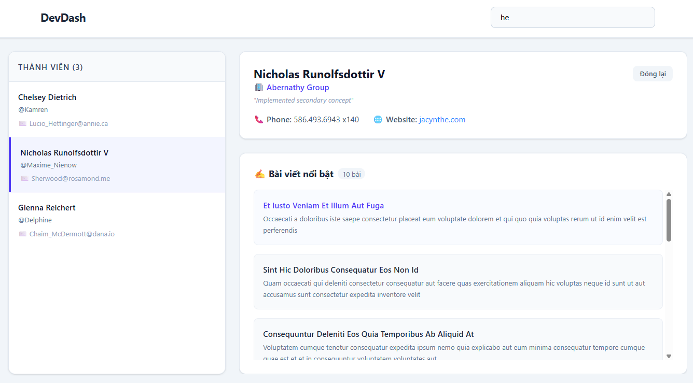

# DevDash — Typed Async Dashboard

**DevDash** is a Single-Page Application (SPA) dashboard for member and post management. It is built entirely on **TypeScript (Strict Mode)**, leveraging advanced **ES6+** features and asynchronous operations like **Async/Await** and **Promise.all**.

The application focuses on code quality, strict modularity, and compile-time type safety to provide a robust and predictable state architecture.

👉 **Live Demo:** [devdash](https://huyendieu8304.github.io/ajt-devdash/)
---

## Screenshots

### Initialization (Idle)


### Loading (Loading)


### Member List (Success)


### Detailed Post Section (Success)


---

## Local Run & Build Instructions

This project is built and managed using Vite. Follow these steps to install and run the application on your machine:

### 1. Prerequisites
- Ensure you have Node.js installed (LTS version 18 or higher is recommended).

### 2. Install Dependencies
Open your project directory in the terminal and execute the following command to install required modules:
```bash
npm install
```

---
## Deployment Instructions

Since this is a static Single-Page Application, it can be hosted on free cloud hosting platforms within minutes:

### Option 1: GitHub Pages (Automated via GitHub Actions)
1. Push your source code repository up to your remote GitHub account.
2. Navigate to your repository **Settings** -> **Pages**.
3. Under the *Build and deployment* source option, select **GitHub Actions**.
4. Choose the standard **Vite** action workflow template. The pipeline will automatically build and publish your app within a minute.

### Option 2: Netlify or Vercel (Manual Drag-and-Drop)
1. Generate your production assets locally by running `npm run build`.
2. Log in to your Netlify or Vercel dashboard.
3. Choose to deploy a new project via manual upload and drag-and-drop the generated `/dist` folder directly into the designated browser zone.
4. The platform will process the folder and provide your live product link instantly.

---

## Completed Features (Checklist)

The project satisfies all requirements across the tiered grading matrix:

### Pass Criteria
- [x] **Strict TypeScript Configuration:** Configured `tsconfig.json` with `"strict": true`, `"noImplicitAny": true`, and `"strictNullChecks": true`. Zero use of the `any` type throughout the codebase.
- [x] **Domain Data Modeling:** Explicitly declared structured interfaces for domain models including `User`, `Post`, and the global `DashboardState`.
- [x] **Discriminated Union State Management:** Modeled application state securely by dividing it into four mutually exclusive statuses: `'idle'`, `'loading'`, `'success'`, and `'error'`.
- [x] **Modular Architecture:** Fully separated concerns into isolated modules: API calls (`api.ts`), State management (`state.ts`), UI rendering (`ui.ts`), and Helpers (`utils.ts`).
- [x] **Event Delegation:** Registered global event listeners (`input` and `click`) onto a single root node (`document.body`) to minimize memory usage and preserve handlers across DOM re-renders.
- [x] **State-Driven UI:** Synchronized DOM updates deterministically based on data state transitions (Loading Spinner to Success View to Detail Section).

### Good Criteria
- [x] **Generic Fetch Helper:** Designed a robust `fetchJson<T>` helper utility that utilizes TypeScript Generics to enforce type safety on network payloads.
- [x] **Parallel Data Loading:** Optimized initial load times using `Promise.all` to execute concurrent API fetches for `Users` and `Posts`, effectively halving network bottleneck delays.
- [x] **Real-Time Client Filter:** Added search capability allowing users to filter members dynamically by Name or Email with case-insensitive comparisons.
- [x] **Form State Preservation:** Implemented focus restoration and character persistence for the search box input element whenever `innerHTML` rewrites the layout.

### Excellent Criteria
- [x] **Exhaustive Type Narrowing:** Leveraged snapshot local variables alongside conditional Guard Clauses (`if-return`) to achieve safe type narrowing under strict null environments.
- [x] **State Immutability Protection:** Encapsulated global state with `Readonly<DashboardState>` paired with an explicit `getState()` getter function to guard data records against external runtime mutations.
- [x] **Custom Debounce Utility:** Implemented a debouncing mechanism (300ms delay) using Closures and Higher-Order Functions to curb redundant filtering computations during rapid keystrokes.
- [x] Clean module architecture, reusable helpers, and a README with run instructions
